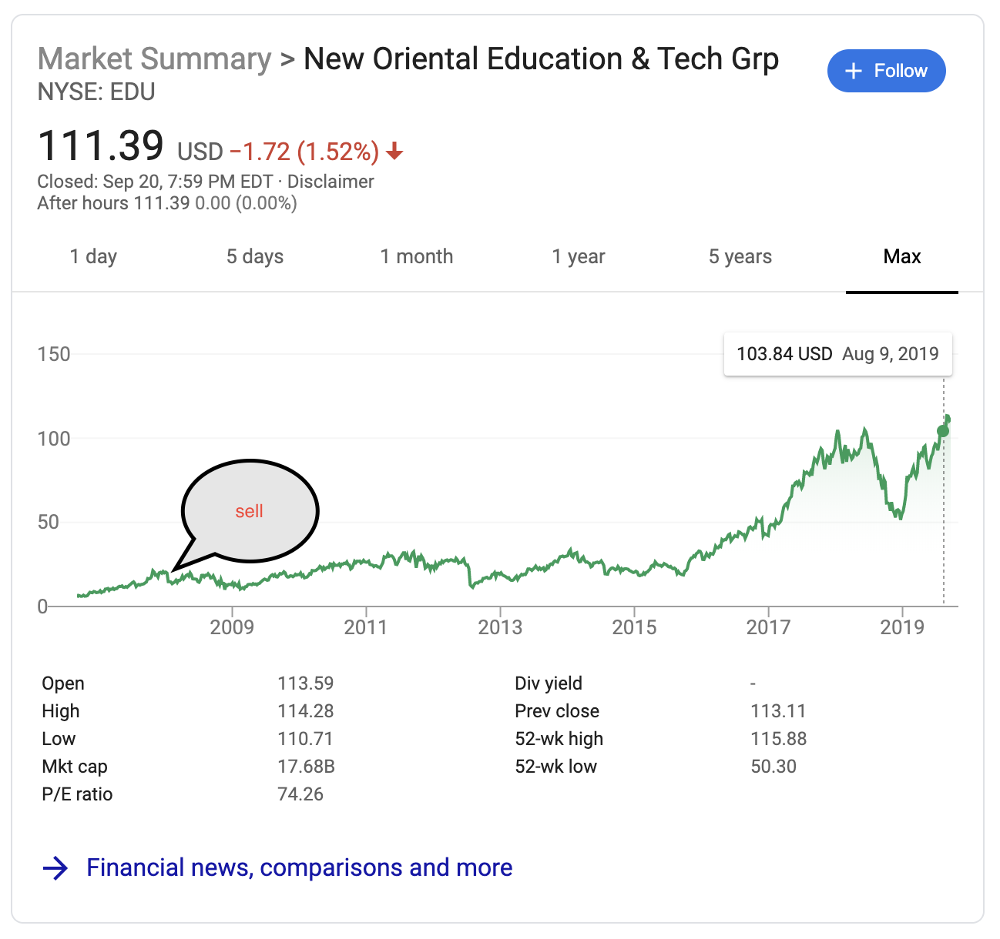
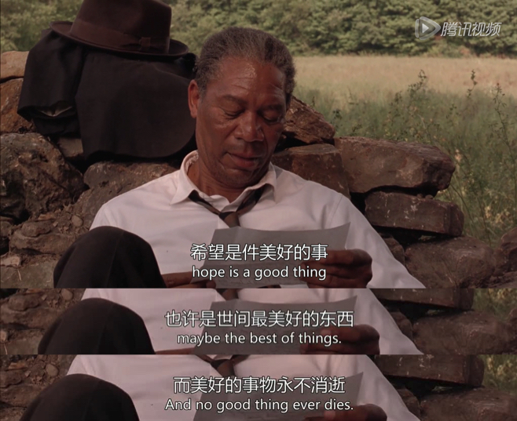
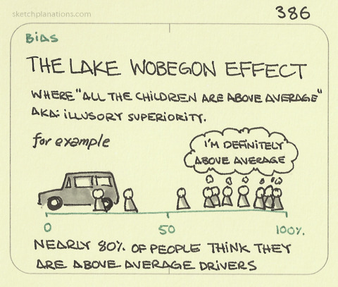
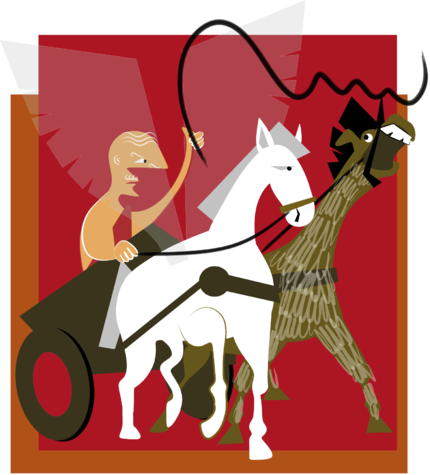

# my-library
我的图书馆

## 投资理财
### 《定投课堂》
#### 2019.07.28 英国老太太的Vivian的复仇计划

盖房子>被邻居告（理由：挡景色）>种树（快速长大的树）>又被告（绿化，vivian胜）。再回头看，树在许多年以后会长高，这是显然易见的事。可见绝大多数人对可预见的未来是没有感知的。

#### 2019.07.29 金融世界里愚昧的现代人

该买的时候买，该卖的时候卖。正确的概率：0.5 * 0.5 = 0.25

如果这世界上的每个人都能在其后一年中，可丁可卯地实现他们的新年愿望，二三十年后，岂不个个都是人中豪杰。

#### 2019.09.23 了解的越多越好吗？

普遍来说，对于一个投资标的，有两种说法：
* 不懂的不要投
* 既然投了，就要更深入的了解

> 反例：李笑来在新东方的经历，就是很多员工在股票上市后的解冻期后套现了（消费或投资），因为他们可能是最了解公司的人，知道内部有种种缺陷，先走为妙。
不管企业还是个人，就市值上的成功，不是因为他身上没有缺点，而是他有一个优点，长期来看，那就是**符合社会发展趋势**。比如茅台，他就是高端消费品，高端人群社交必需品。比如同学中的小白，他长期在保险公司。

> “横看成岭侧成峰，远近高低各不同。 不识庐山真面目，只缘身在此山中。” —— 《题西林壁》苏轼 苏东坡

知道很多内部毛病固然是好事，但也别忘了，**跳起来宏观地去看公司及个人的发展**。

#### 2019.09.24 我们是一群心怀希望的人

肖申克的救赎

#### 2019.09.25 以终为始 —— 99% 的人终生未用过的思考工具

> 牛逼作家写小说，先设定好一个牛逼的结局，再一步步思考各个角色的发展。创业也是，最终我们想要做成什么样子？这样几年后哪怕失败，也可以分析哪里做错了。俞敏洪带领新东方达到年化26%的回报。社会进步发展的核心本质是好人也可以赚钱了，越来越多的好人可以赚越来越多的钱了。这是社会发展趋势。

> 面对暴跌，不仅仅是心理素质好，而是有的人有思考工具。互联网是信息流动的成本降低趋近于零（西天取经），世界改变了。比特币也是将资产流动的速度提高了，与此同时成本降低趋近于零。然后将比特币想象成一个公司的市值。

这让我想起来，有人将人生目标设定为财务自由，再回头想如何一步一步做到。

#### 2019.09.26 普遍的认知失调及其副作用

乌比冈湖小镇效应：乌比冈湖小镇是一个假想的，在美国中部的小镇，镇上的女人都很强，男人都长得不错。更为有趣的是，不仅女人都很强，男人都长得不错，所有的小孩都在平均水平之上，叫above average effect, 说所有的小孩都平均以上，这怎么可能吗，这根本就不可能的，对吧？那么我们以前也从各个地方听说过这样一件事情，就是90%的人认为自己的驾驶水平在平均水平以上，这显然是有相当一部分人想错了，对吧？为什么会出现这种情况呢？我们深究其根源的话呢，有一个原因是这样子的，就是每个人呢都希望自己是平均水平以上的，对吧？每个人都希望自己nice and smart聪明且善良，对吧？每个人都希望自己是这样子的，可事实上呢啊，在任何一个领域啊，都不是这样的。

与乌比冈湖效应相类似的另一种效应为“杜宁-克鲁格效应”,即“越差越牛逼，越强越谦虚”的现象。谦虚是一种习得的本领。

#### 2019.09.27 控制情绪的唯一有效方法：成长

柏拉图的战车比喻：
* 骑手-大脑皮层，人类大脑
* 黑马-直觉，鳄鱼大脑
* 白马-情绪，猴子大脑

淡定是一种能力。

#### 2019.10.10 定投策略无需再次改良

短期来看市场是投票机，长期来看它是称重机。一一本杰明·格雷厄姆

#### 2019.10.11 你快乐吗？

绝大多数人并不快乐，因为他们的快乐建立在与他人计较基础上的。（能力、长相、家境、财富、身高）。大部分人对于幸福的定义，就是你比你的妹夫多赚20%。

* 主动停止与他人的无谓比较
* 与自己比（三个自己，车夫、白马、黑马）

#### 2019.10.12 走过路过不要错过

#### 2019.10.16 

定投策略之所以有效，核心机理在于这个策略符合现实生活中的真实情况。那就是**熊市就是比牛市长，并且长很多很多**。

#### 2019.10.18 为什么一定要用钱去赚钱？

### 《定投 —— 大佬的自我修养》
#### 5. 为什么只有很少的人使用定投这么神奇的策略
> * 你的房产，的确算作是资产，可其流动性趋近于零；
> * 你的同学的股票，同样算作是资产，可其流动性却几乎是 100%……
> * 人们购买了大量的财产，不是资产，资产可以每年生产东西出来，财产不但不能生产东西出来，还需要大量的资金来支持来养护它。
